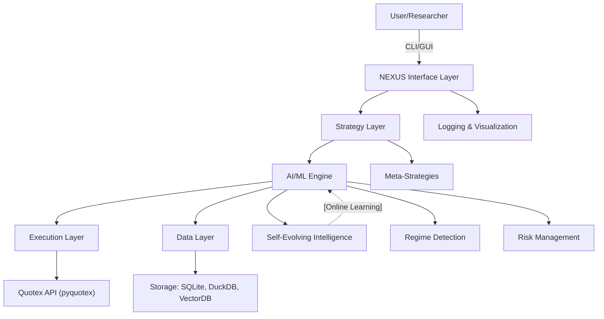
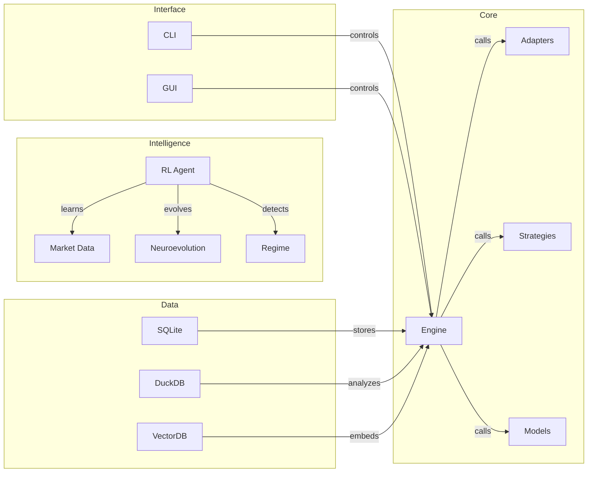

# NEXUS: The Ultimate Free-Form, Self-Evolving AI Trader for Quotex

<p align="center">
  
  
  
  
  
  
  
</p>

---

> <span style="font-size:1.5em; font-weight:bold;">NEXUS is a creative, modular, self-evolving AI trading platform for Quotex, built with Python 3.13.5 and managed with UV. This README is both a vision and a roadmap: features marked as [TODO] are planned, not yet implemented. All instructions and code reflect the actual project structure and current capabilities.</span>

---

# Table of Contents
- [Vision & Philosophy](#vision--philosophy)
- [Features at a Glance](#features-at-a-glance)
- [Architecture Overview](#architecture-overview)
- [System Diagrams](#system-diagrams)
- [Core Modules](#core-modules)
- [Installation & Quick Start](#installation--quick-start)
- [Configuration](#configuration)
- [Usage Examples](#usage-examples)
- [Extending NEXUS](#extending-nexus)
- [Testing & CI/CD](#testing--cicd)
- [Security](#security)
- [Troubleshooting](#troubleshooting)
- [FAQ](#faq)
- [Glossary](#glossary)
- [Contributing](#contributing)
- [Code of Conduct](#code-of-conduct)
- [License](#license)
- [Acknowledgements](#acknowledgements)
- [Appendix: Full System Architecture](#appendix-full-system-architecture)
- [Appendix: Advanced Topics](#appendix-advanced-topics)
- [Appendix: API Reference](#appendix-api-reference)
- [Appendix: Changelog](#appendix-changelog)
- [Appendix: Community & Support](#appendix-community--support)
- [Appendix: Credits](#appendix-credits)
- [Appendix: Legal](#appendix-legal)

---

# Vision & Philosophy

NEXUS is built on the belief that trading intelligence should be:
- **Unrestricted**: No artificial limits on architecture, strategy, or creativity.
- **Self-Evolving**: Capable of learning, adapting, and improving in real time.
- **Transparent**: Every decision, every trade, every model is auditable and explainable.
- **Community-Driven**: Designed for researchers, quants, and creative technologists.
- **Modular**: Every component is replaceable, extensible, and hackable.
- **Secure & Private**: All data is local by default, with strong security best practices.

---

# Features at a Glance

| Feature                        | Status      | Description |
|------------------------------- |------------ |-------------|
| Quotex Integration             | ✅          | Real-time trading, candles, balance, via `pyquotex` |
| Self-Evolving AI               | 🚧 [WIP]    | RL, regime detection, neuroevolution, adversarial/self-play |
| Multi-Interface                | ✅          | CLI, GUI (PySide6), dashboards |
| Modular Strategies             | ✅          | Plug-and-play, meta-strategies, custom modules |
| Advanced Risk Management       | 🚧 [WIP]    | Kelly, VaR, drawdown, emotional modeling |
| Multi-Modal Storage            | ✅          | SQLite, DuckDB, [TODO: Chroma, LanceDB, time-series] |
| Performance Hotspots           | 🚧 [WIP]    | Rust (pyo3), Cython, asyncio/trio |
| CI/CD & Testing                | ✅          | Test suite, GitHub Actions, [TODO: pre-commit] |
| Security                       | ✅          | Policy, best practices, encrypted storage [TODO] |

---

# Architecture Overview

NEXUS is a modular, multi-layered system:
- **AI/ML Engine**: RL, regime detection, neuroevolution, transformers, adversarial/self-play.
- **Strategy Layer**: Meta-strategies, custom user strategies, self-play, adversarial training.
- **Execution Layer**: Real-time trading via Quotex (pyquotex), robust risk/session management.
- **Interface Layer**: CLI, GUI (PySide6), dashboards, logging, visualization.
- **Data Layer**: SQLite, DuckDB, [TODO: vector DBs, time-series DBs, hybrid storage].
- **Tooling Layer**: CI/CD, testing, packaging, deployment, profiling.

---

# System Diagrams

## High-Level System Flow



## Modular Extensibility



---

# Core Modules

## AI/ML Engine
- **Reinforcement Learning (RL) Agent**: DQN, PPO, A3C, custom RL algorithms. [TODO: PPO, A3C]
- **Online Learning**: [TODO] Continuous adaptation to new data.
- **Self-Play & Adversarial Training**: [TODO] Compete against itself for robust strategies.
- **Transformer & LSTM Models**: [TODO] Multi-feature, multi-asset forecasting, regime-aware sequence modeling.
- **Regime Detection**: Real-time detection of market regimes (trending, mean-reverting, volatile, etc.), switches strategies and risk models on the fly.
- **Neuroevolution**: [TODO] Evolutionary optimization of strategies and neural architectures.
- **Emotional Modeling**: [TODO] Simulate FOMO, stress, and other trader emotions.

## Strategy Layer
- **Meta-Strategies**: Strategies that select/manage other strategies.
- **Plug-and-Play**: Drop in new strategies in `nexus/strategies/`.
- **Custom User Modules**: Easily add your own logic.

## Execution Layer
- **Quotex Integration**: Authentication, candle retrieval, balance checks, trade execution via `pyquotex`.
- **Session Management**: Robust, with reconnection and error handling.
- **Risk Controls**: Kelly, VaR, drawdown, emotional overlays.

## Interface Layer
- **CLI**: Analytics, trade logs, system control.
- **GUI (PySide6)**: Dashboard for analytics, strategy management, live monitoring.
- **Logging & Visualization**: Metrics, audit trails, advanced dashboards [TODO].

## Data Layer
- **SQLite**: Local storage for configs and trade history.
- **DuckDB**: Analytics and fast OLAP queries.
- **Vector DBs**: [TODO] Chroma, LanceDB, time-series DBs, hybrid storage.

## Tooling Layer
- **CI/CD**: GitHub Actions, test suite, packaging, deployment.
- **Profiling & Optimization**: [TODO] Rust (pyo3), Cython, asyncio/trio.

---

# Installation & Quick Start

## Prerequisites
- Python 3.13.5 (strictly enforced)
- [UV](https://github.com/astral-sh/uv) for dependency management
- Git

## Install Steps

```bash
uv venv .venv
source .venv/bin/activate  # or .venv\Scripts\activate on Windows
uv pip install -e .
```

---

# Configuration

- All configuration is managed via `config.yaml` and `settings/config.ini`.
- Example config options:
  - API credentials (never commit secrets!)
  - Model/strategy selection
  - Risk parameters
  - Logging and storage options
- See `config.yaml` for a full reference.

---

# Usage Examples

## Authenticate and Check Balance
```python
from nexus.client import NexusClient
client = NexusClient(email="your@email.com", password="yourpassword", lang="en")
print(client.get_balance())
```

## Run a Backtest
```python
from nexus.core.engine import backtest
results = backtest(strategy="meta_strategy", start_date="2024-01-01", end_date="2024-06-01")
print(results.summary())
```

## Launch the GUI
```bash
uv python -m nexus.gui.launch_gui
```

## Add a Custom Strategy
- Place your strategy in `nexus/strategies/` and register it in `nexus/registry.py`.

---

# Extending NEXUS

- Add new RL/ML models in `nexus/intelligence/` and register in `nexus/models.py`.
- Integrate new data sources or brokers via `nexus/adapters/`. [TODO: adapters for other brokers]
- Add new dashboard views in `nexus/gui/views/`.
- Patch or extend `pyquotex` in `nexus/adapters/pyquotex_patch.py`.
- Contribute new risk models, regime detectors, or emotional models. [TODO: emotional models]

---

# Testing & CI/CD

- Run all tests:
```bash
uv python -m pytest tests/
```
- Lint and format code:
```bash
uv pip install black flake8
uv python -m black .
uv python -m flake8 .
```
- GitHub Actions workflows for CI/CD in `.github/workflows/`.
- [TODO: Pre-commit hooks for style and quality]

---

# Security

- See [SECURITY.md](SECURITY.md) for vulnerability reporting and best practices.
- Never share your API keys or credentials.
- Use encrypted storage for sensitive data. [TODO: encryption]
- Regularly update dependencies with UV.

---

# Troubleshooting

- **Installation issues**: Check Python version (must be 3.13.5), update UV, and ensure all dependencies are installed.
- **Quotex API errors**: Ensure credentials are correct and `lang="en"` is set in all API calls.
- **Model/strategy errors**: Check logs in `logs/` and ensure all required models are present in `models/`.
- **GUI issues**: Ensure PySide6 is installed and your system supports Qt.
- **Performance**: [TODO: Profile with built-in tools, optimize with Rust/Cython as needed.]

---

# FAQ

**Q: Can I use NEXUS with other brokers?**
A: NEXUS is designed for Quotex via `pyquotex`, but the architecture is modular—adapters for other brokers are [TODO].

**Q: How do I contribute a new model or strategy?**
A: See [Extending NEXUS](#extending-nexus) and [CONTRIBUTING.md](CONTRIBUTING.md).

**Q: Is there a REST API?**
A: [TODO: Not yet, but the architecture supports adding one easily.]

**Q: How does NEXUS self-evolve?**
A: [TODO: Through online learning, neuroevolution, and adversarial/self-play training.]

**Q: Is my data private?**
A: Yes. All data is stored locally by default. See [Security](#security).

---

# Glossary

- **RL**: Reinforcement Learning
- **PPO/DQN/A3C**: Popular RL algorithms [TODO: PPO/A3C]
- **Regime Detection**: Identifying market conditions
- **Neuroevolution**: [TODO: Evolving neural networks]
- **Meta-Strategy**: Strategy that selects/manages other strategies
- **Vector DB**: [TODO: Database for vector embeddings (e.g., Chroma, LanceDB)]
- **Self-Play**: [TODO: Training by competing against itself]
- **FOMO**: [TODO: Fear of Missing Out]

---

# Contributing

See [CONTRIBUTING.md](CONTRIBUTING.md) for detailed guidelines, coding standards, and the pull request process.

---

# Code of Conduct

See [CODE_OF_CONDUCT.md](CODE_OF_CONDUCT.md) for our community standards and enforcement policies.

---

# License

NEXUS is licensed under the MIT License. See [LICENSE](LICENSE) for details.

---

# Acknowledgements

- [pyquotex](https://github.com/cleitonleonel/pyquotex) — Unofficial Quotex API
- [PyTorch](https://pytorch.org/), [TensorFlow](https://www.tensorflow.org/), [JAX](https://jax.readthedocs.io/) [TODO: not yet integrated]
- [DuckDB](https://duckdb.org/), [SQLite](https://www.sqlite.org/)
- [PySide6](https://wiki.qt.io/Qt_for_Python)
- All contributors and the open-source community

---

# Appendix: Full System Architecture

## Directory Structure

```
NEXUS/
├── nexus/                # Core source code (engine, models, adapters, strategies, utils)
│   ├── core/             # Trading engine, evolution, memory
│   ├── data/             # Data handling and trade history
│   ├── gui/              # GUI dashboard and views
│   ├── intelligence/     # ML, RL, and regime detection modules
│   ├── strategies/       # Built-in and custom trading strategies
│   └── utils/            # Logging, metrics, technical analysis
├── models/               # Pretrained and custom models
├── data/                 # Analytics, trade history, vector memory
├── settings/             # Configuration files
├── tests/                # Unit and integration tests
├── LICENSE               # License file
├── pyproject.toml        # Build and dependency management
├── README.md             # This file
└── ...                   # Other project files
```

## Example: Custom RL Agent (Pseudocode)

```python
# [TODO: Implement a real RL agent in nexus/intelligence/rl_agent.py]
class CustomRLAgent:
    def __init__(self, ...):
        # ...init code...
    def select_action(self, state):
        # ...RL logic...
    def update(self, reward, next_state):
        # ...learning logic...
```

## Example: Extending pyquotex

```python
from pyquotex.stable_api import Quotex
class PatchedQuotex(Quotex):
    def custom_ws_flow(self, ...):
        # ...custom WebSocket logic...
```

## Example: Adding a New Dashboard View

- Create a new file in `nexus/gui/views/` (e.g., `my_view.py`).
- Register the view in `nexus/gui/main_window.py`.

---

# Appendix: Advanced Topics

## Quantum-Inspired Tuning
- [TODO: Use quantum-inspired algorithms for hyperparameter search.]

## Local LLM Integration
- [TODO: Integrate local LLMs for strategy generation and analysis.]

## Synthetic Data Generation
- [TODO: Use GANs or VAEs to generate synthetic market data for training.]

## Async Trading
- [TODO: Use `asyncio` or `trio` for high-frequency, low-latency trading flows.]

## Rust/Cython Hotspots
- [TODO: Profile and optimize critical code paths with Rust (via pyo3/maturin) or Cython.]

---

# Appendix: API Reference

[TODO: See docs/API_REFERENCE.md (coming soon) for a complete API reference.]

---

# Appendix: Changelog

[TODO: See CHANGELOG.md (coming soon) for release notes and version history.]

---

# Appendix: Community & Support

- GitHub Discussions
- [TODO: Discord/Matrix/Telegram]


---

# Appendix: Credits

- Project Lead: [Swapnil]

---

# Appendix: Legal

NEXUS is not affiliated with Quotex. Use at your own risk. Trading is inherently risky. See [LICENSE](LICENSE) for details.

---
