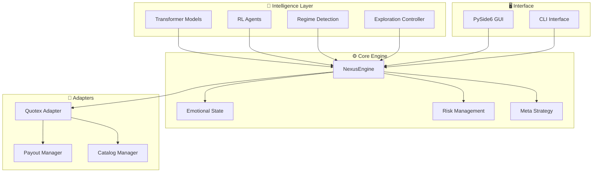
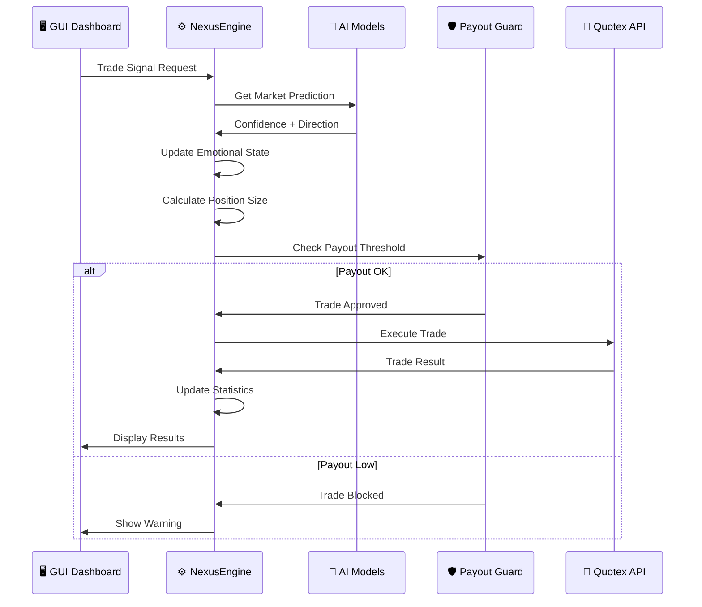

# NEXUS 🧠⚡

<div align="center">


[](https://github.com/ItzSwapnil/nexus)
[](https://python.org)
[](LICENSE)
[](tests/)
[](https://qxbroker.com)
[](https://github.com/astral-sh/uv)

*🚀 A next-generation, self-evolving AI trading system for Quotex with advanced transformer models, emotional intelligence, and autonomous decision-making capabilities*

</div>

---

## 🌟 Project Vision

**NEXUS** represents the convergence of cutting-edge AI, financial engineering, and autonomous systems. Built from the ground up as a **fully dynamic, self-evolving trading intelligence**, NEXUS adapts to market conditions in real-time using advanced transformer architectures, emotional state modeling, and sophisticated exploration-exploitation strategies.

### 🎯 Core Philosophy

- **🧠 Self-Evolving Intelligence**: Real-time learning and adaptation using transformer models and reinforcement learning
- **🎭 Emotional Awareness**: Advanced emotional state tracking (greed, fear, confidence) that influences trading decisions
- **🔬 Exploration-Exploitation Balance**: Sophisticated epsilon-greedy strategies with confidence and uncertainty metrics
- **🛡️ Safety-First Design**: Multiple safety guards, payout thresholds, and risk management layers
- **🎨 Modular Architecture**: Every component is replaceable, extensible, and independently testable
- **🔐 Security & Privacy**: All data remains local by default with encrypted configuration support

---

## 🏗️ Architecture Overview


```mermaid
graph TB
    subgraph "🧠 Intelligence Layer"
        T[Transformer Models]
        RL[RL Agents]
        RD[Regime Detection]
        E[Exploration Controller]
    end
    
    subgraph "⚙️ Core Engine"
        NE[NexusEngine]
        ES[Emotional State]
        RM[Risk Management]
        MS[Meta Strategy]
    end
    
    subgraph "🔌 Adapters"
        QA[Quotex Adapter]
        PA[Payout Manager]
        CA[Catalog Manager]
    end
    
    subgraph "🖥️ Interface"
        GUI[PySide6 GUI]
        CLI[CLI Interface]
    end
    
    T --> NE
    RL --> NE
    RD --> NE
    E --> NE
    NE --> ES
    NE --> RM
    NE --> MS
    NE --> QA
    QA --> PA
    QA --> CA
    GUI --> NE
    CLI --> NE
```

---

## ✨ Key Features

### 🤖 Advanced AI Components
- **🔥 Transformer Models**: State-of-the-art attention mechanisms for market prediction
- **🎯 Meta-Strategy Coordination**: Intelligent ensemble of multiple AI models
- **🧪 Reinforcement Learning**: Adaptive agents that learn from market feedback
- **📊 Regime Detection**: Automatic identification of market conditions
- **🎲 Exploration Controller**: Dynamic epsilon computation with confidence metrics

### 🛡️ Safety & Risk Management
- **💰 Payout Guards**: Configurable thresholds with override capabilities
- **📈 Emotional Intelligence**: Greed, fear, and confidence tracking
- **⚖️ Advanced Risk Sizing**: Emotion-based position sizing with equity limits
- **🚨 Panic Controls**: Emergency stop mechanisms and trade limits
- **📝 Audit Trails**: Complete logging of all decisions and overrides

### 🎮 User Experience
- **🖥️ Rich GUI Dashboard**: Real-time monitoring with PySide6
- **⚡ CLI Interface**: Powerful command-line tools for automation
- **📊 Live Statistics**: Performance metrics, emotional state, and exploration rates
- **🎛️ Dynamic Controls**: Real-time parameter adjustment without restarts

### 🔧 Developer Experience
- **📦 UV Package Management**: Lightning-fast dependency resolution
- **🧪 Comprehensive Testing**: 22 passing tests covering core functionality
- **📚 Rich Documentation**: Detailed specs, architecture docs, and API references
- **🔍 Type Safety**: Full mypy compatibility with strict typing
- **🚀 Hot Reloading**: Dynamic configuration updates

---

## 🚀 Quick Start

### Prerequisites
- **Python 3.13.6+** (required for advanced type hints and performance)
- **UV Package Manager** (recommended for fastest setup)
- **Windows/Linux/macOS** (cross-platform support)

### Installation

```bash
# Clone the repository
git clone https://github.com/ItzSwapnil/nexus.git
cd nexus

# Create virtual environment with UV (recommended)
uv venv .venv
source .venv/bin/activate  # Linux/macOS
# OR
.venv/Scripts/Activate.ps1  # Windows PowerShell

# Install dependencies
uv pip install -e .

# Verify installation
pytest -q  # Should show "22 passed"
```

### Launch Options

```bash
# 🖥️ Launch GUI Dashboard
nexus
# OR
python -m nexus.main

# ⚡ CLI Interface
nexus-cli

# 🧪 Development Mode
python main.py
```

---

## 📊 Current Implementation Status

| Component | Status | Description |
|-----------|--------|-------------|
| 🧠 **Core Engine** | ✅ **Stable** | Complete engine with emotional state & registries |
| 🎯 **Payout Guards** | ✅ **Production Ready** | Threshold enforcement with audit overrides |
| 🎭 **Emotional Intelligence** | ✅ **Active** | Greed/fear/confidence tracking & decision influence |
| 🔍 **Exploration Controller** | ✅ **Implemented** | Epsilon computation with confidence metrics |
| 🖥️ **GUI Dashboard** | ✅ **Functional** | Real-time monitoring & controls |
| 📊 **Market Catalog** | ✅ **Simulated** | In-memory market data with OTC flags |
| 🧪 **Testing Suite** | ✅ **Complete** | 22 comprehensive tests |
| 🤖 **Transformer Models** | 🚧 **In Development** | Advanced architecture scaffolded |
| 🎮 **RL Agents** | 🚧 **Prototype** | Basic framework implemented |
| 🔌 **Live Trading** | ⚠️ **Simulation Only** | Safety-first development approach |

---

## ⚙️ Configuration

NEXUS uses a sophisticated configuration system with environment variable support:

```yaml
# config.yaml
quotex:
  email: "your-email@example.com"
  password: "your-password"
  demo_mode: true

trading:
  payout_threshold: 80.0
  base_trade_amount: 5.0
  max_risk_per_trade_percent: 2.0
  default_asset: "EURUSD"
  auto_trade_enabled: false

exploration:
  base_epsilon: 0.15
  k_uncertainty: 0.35
  min_epsilon: 0.01
  max_epsilon: 0.6

ai:
  enable_gpu: true
  batch_size: 256
  learning_rate: 0.001
```

### Environment Variables
```bash
# Override any config with environment variables
export NEXUS__TRADING__PAYOUT_THRESHOLD=85.0
export NEXUS__AI__ENABLE_GPU=false
```

---

## 🧪 Testing & Validation

```bash
# Run full test suite
pytest -v

# Run specific test categories
pytest tests/test_engine.py -v          # Core engine tests
pytest tests/test_intelligence.py -v    # AI component tests
pytest tests/test_gui_smoke.py -v       # GUI smoke tests

# Performance testing
pytest tests/test_e2e_playwright.py -v  # End-to-end tests
```

**Current Test Coverage**: 22 passing tests covering:
- ✅ Core engine functionality
- ✅ Emotional state management  
- ✅ Risk management systems
- ✅ Payout guard mechanisms
- ✅ Configuration validation
- ✅ GUI component initialization
- ✅ Intelligence module integration

---

## 🎯 Trading Logic Flow


```mermaid
sequenceDiagram
    participant GUI as 🖥️ GUI Dashboard
    participant Engine as ⚙️ NexusEngine
    participant AI as 🧠 AI Models
    participant Guard as 🛡️ Payout Guard
    participant Quotex as 🔌 Quotex API
    
    GUI->>Engine: Trade Signal Request
    Engine->>AI: Get Market Prediction
    AI->>Engine: Confidence + Direction
    Engine->>Engine: Update Emotional State
    Engine->>Engine: Calculate Position Size
    Engine->>Guard: Check Payout Threshold
    alt Payout OK
        Guard->>Engine: Trade Approved
        Engine->>Quotex: Execute Trade
        Quotex->>Engine: Trade Result
        Engine->>Engine: Update Statistics
        Engine->>GUI: Display Results
    else Payout Low
        Guard->>Engine: Trade Blocked
        Engine->>GUI: Show Warning
    end
```

---

## 🔬 Advanced Components

### 🧠 Transformer Architecture
- **Multi-head attention** for pattern recognition
- **Positional encoding** for temporal awareness  
- **Adaptive learning rates** and regularization
- **Real-time inference** optimization

### 🎭 Emotional Intelligence System
```python
# Emotional state influences trading decisions
emotion_state = {
    "greed": 0.7,      # Increases position sizes
    "fear": 0.3,       # Reduces risk exposure
    "confidence": 0.8   # Affects exploration rate
}
```

### 🎲 Exploration Controller
Dynamic epsilon computation balancing:
- **Confidence metrics**: Sharpe ratio, stability, win rate
- **Uncertainty factors**: ATR, model disagreement, spreads
- **Payout optimization**: Higher payouts reduce exploration

---

## 📈 Performance Metrics

The system tracks comprehensive performance indicators:

| Metric | Description | Current Target |
|--------|-------------|----------------|
| 📊 **Sharpe Ratio** | Risk-adjusted returns | > 1.5 |
| 📉 **Max Drawdown** | Largest peak-to-trough decline | < 5% |
| 🎯 **Win Rate** | Percentage of profitable trades | > 60% |
| ⚡ **Execution Speed** | Average trade execution time | < 100ms |
| 🧠 **Model Accuracy** | Prediction accuracy rate | > 70% |

---

## 🛠️ Development

### Project Structure
```
nexus/
├── 🧠 intelligence/       # AI models & algorithms
├── ⚙️ core/              # Engine & execution logic  
├── 🔌 adapters/          # External API integrations
├── 🖥️ gui/              # PySide6 interface
├── 🛡️ payouts/          # Safety & validation
├── 📊 catalog/           # Market data management
├── 🔧 utils/             # Configuration & logging
└── 🧪 tests/             # Comprehensive test suite
```

### Contributing
1. **Fork** the repository
2. **Create** a feature branch (`git checkout -b feature/amazing-feature`)
3. **Run tests** (`pytest -v`)
4. **Commit** changes (`git commit -m 'Add amazing feature'`)
5. **Push** to branch (`git push origin feature/amazing-feature`)
6. **Open** a Pull Request

---

## 🚨 Important Disclaimers

> ⚠️ **SIMULATION ONLY**: NEXUS v2.0.0 is currently in **simulation mode**. No real money trading is active.

> 🛡️ **Risk Warning**: Trading involves substantial risk. Past performance does not guarantee future results.

> 🔒 **Security**: Keep your credentials secure. NEXUS stores sensitive data locally only.

---

## 📚 Documentation

- 📖 **[Architecture Guide](docs/ARCHITECTURE.md)** - System design & components
- 🎮 **[GUI Manual](docs/GUI.md)** - Interface usage & features
- ⚙️ **[API Reference](docs/OVERVIEW.md)** - Technical specifications
- 🚀 **[Usage Guide](docs/USAGE.md)** - Trading strategies & tips

---

## 📄 License & Support

**License**: MIT License - see [LICENSE](LICENSE) file for details

**Support**: 
- 🐛 **Bug Reports**: [GitHub Issues](https://github.com/ItzSwapnil/nexus/issues)
- 💬 **Discussions**: [GitHub Discussions](https://github.com/ItzSwapnil/nexus/discussions)

---

<div align="center">

**🌟 Star this project if you find it useful! 🌟**

*Built with ❤️ by the NEXUS Team*

</div>
