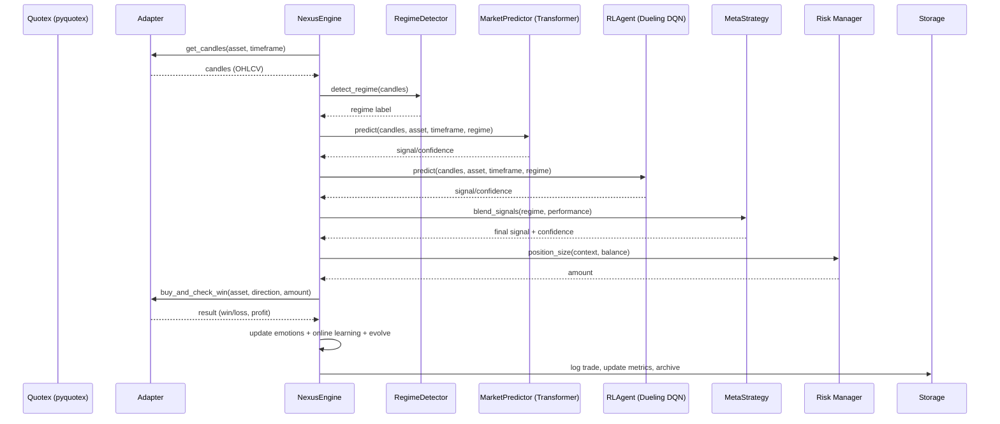

# NEXUS Architecture

NEXUS is a modular, self‑evolving AI trader for Quotex designed for full runtime dynamism and online learning. All logs, UI text, and API calls are in English.

- Language/runtime: Python 3.13.x
- Package manager: uv
- Broker API: pyquotex (unofficial)

High‑level components
- Adapters: Robust async adapter around pyquotex, enforcing lang="en" and adding retries, caching, and normalization.
- Core Engine: Orchestrates data flow, regime detection, model ensemble, strategy selection, online learning, and execution.
- Intelligence: Transformer predictor, Double‑DQN RL agent, and HMM+KMeans regime detector with live adaptation.
- Strategies: Meta‑strategy blending signals with bandit‑style exploration/exploitation and performance feedback.
- Risk: Advanced risk management with dynamic Kelly fraction, VaR shaping, and emotion‑aware modifiers.
- Memory: Vector memory for experience and analysis snapshots.
- GUI/CLI/API: PySide6 dashboard and CLI with live controls and dynamic asset discovery.
- Data/Storage: DuckDB/SQLite/vectors supported; models/logs auto‑archived.

Sequence: market data to decision to execution

Runtime dynamism
- Assets/timeframes/intervals: fetched live via adapter (CLI supports --assets auto) or set in GUI at runtime.
- Risk/model params: adjusted live using regime classification, emotional state, and rolling performance.
- Online learning: RL agent memory updates and transformer online LR adaptation via update_from_trade; evolutionary optimizer can run in the background.

Data model (core)
- Candles: pandas.DataFrame with [open, high, low, close, volume, timestamp].
- Prediction: {signal: call/put/hold, confidence: float [0..1], reasoning: str}.
- Trade record: {asset, signal_type, amount, expiration, success, profit, timeframe, timestamp}.

Resilience & safety
- Retries with exponential backoff for network calls.
- Caching with TTL for candles.
- Demo mode default for safe testing; English locale enforced everywhere.

Extensibility
- Registries for strategies and models enable hot‑swapping.
- Add adapters for new data sources; plug‑in regime detectors or sentiment feeds easily.

Performance
- Async IO for network; vectorized preprocessing; PyTorch on CUDA if available.
- Optional Rust/Cython acceleration can be added to feature engineering hot paths.

CI/CD
- GitHub Actions runs lint, types, tests with uv. Artifacts uploaded for auditing.

